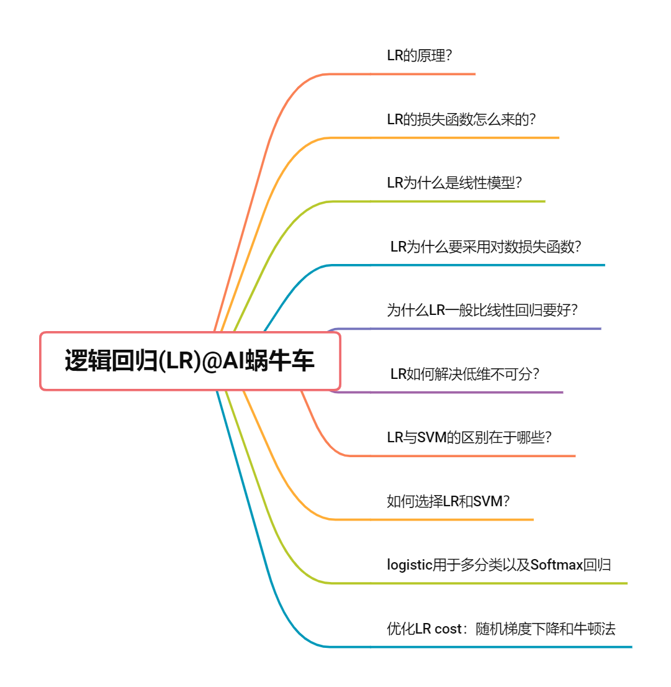
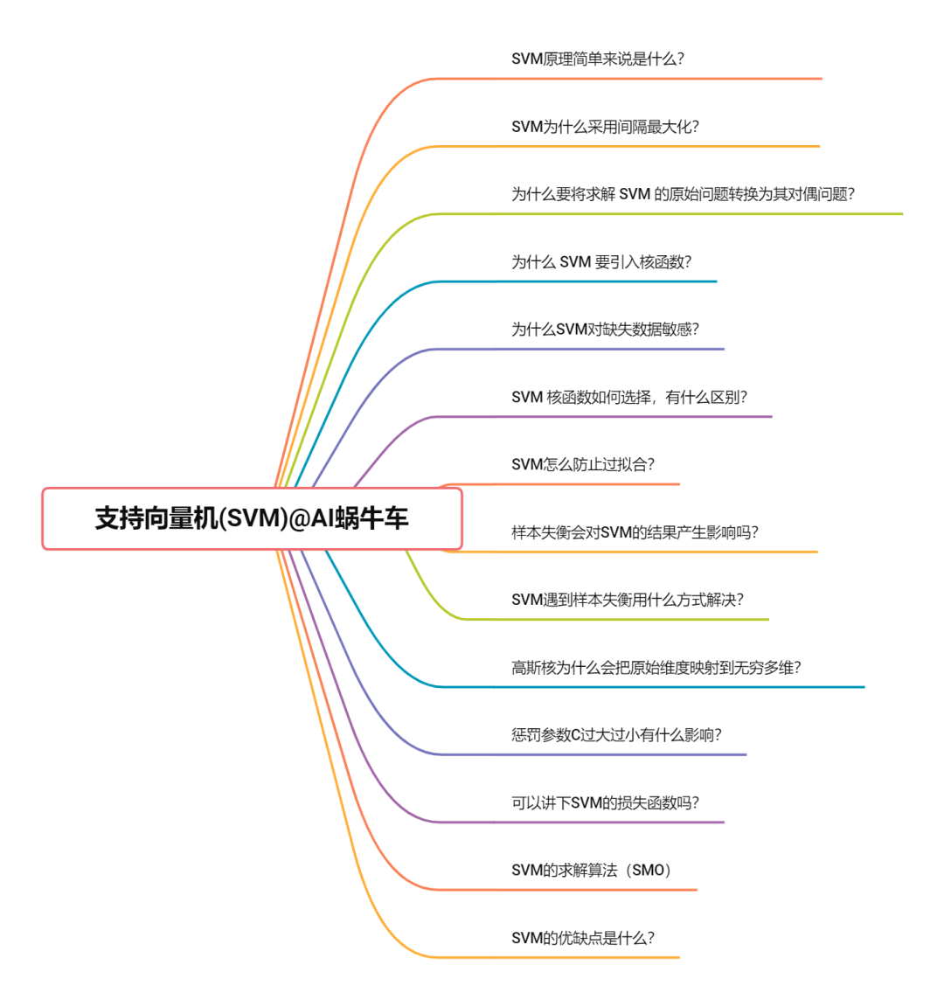

# machine-learning-interview-chinese
全中文的机器学习算法工程师面试基础问题总结

本repo是本人在算法岗求职路上所做的笔记，大概花费了一个多月的时间整理。

我主要面试的岗位大多是:机器学习算法工程师、数据挖掘算法工程师等岗位。

但现在的面试只要是算法岗，一般来说都会默认要求会这些基础知识，所以如果你所面试的岗位不是机器学习算法工程师，但依然是算法岗，我想你依然要掌握以下这些知识。

主要包含机器学习和深度学习的基础部分，以及一些常见基础知识，**本repo可能不会去教会你，所以是入门的同学建议去看下[人工智能的学习路线](https://github.com/chehongshu/Artificial-intelligence-diamond-chinese)，先把这些知识点详细啃会了，再回来把以下内容当作自己复习、整理和总结的材料，这样效果最佳。

机器学习主要由我和我的朋友贝壳er共同整理，深度学习部分由我单独整理。

创建这个repo的目的有以下几点
- 我热爱分享，一直长期开源和写作，自己从中收益，当然也想一直回馈开源。
- 这些是我花费大量时间整理的，我想也会节省大家一些时间
- 还有很多没有概括全面的地方，所以想一直可以去不断的update，如果不开repo可能没有那么大的坚持了
- 大多数资料都是英文的，并且繁多，而这个repo的宗旨是全中文的资料，且简洁
## 初学者
请看
[人工智能的学习路线](https://github.com/chehongshu/Artificial-intelligence-diamond-chinese)

全中文的人工智能教程和资料，只选“精品”，如“钻石”般精致。

## 算法岗求职笔记列表
### 机器学习
- [KNN(K近邻算法) · 六问六答](#1.1)
- [逻辑回归（Logistic Regession，LR） · 十问十答](#1.2)
- [朴素贝叶斯 · 十七问十七答](#1.3)
- [决策树 · 二十一问二十一答](#1.4)
- [支持向量机(SVM) · 十四问十四答](#1.5)
- [聚类 · 十三问十三答](#1.6)
- [降维 · 五问五答](#1.7)
- [集成学习（一）通用概念 · 八问八答](#1.8)
- [集成学习（二）随机森林RF · 十一问十一答](#1.9)
- [集成学习（三）Adaboost · 四问四答](#1.10)
- [集成学习（四）GBDT · 九问九答](#1.11)

### 深度学习

- [感知机 · 四问四答](#2.1)
- [DNN(深度神经网络) · 四问五答](#2.2)

## 
K近邻算法

  
 
**点击这里查看文章:**
 - [KNN(K近邻) · 六问六答](https://mp.weixin.qq.com/s?__biz=MzA4ODUxNjUzMQ==&mid=2247498203&idx=1&sn=806834f3f71e9cdb2985cff27c4bd667&chksm=902a4b07a75dc2114f3c726f4e9bf78ff56253aa37d22ed88f5fb54e1f260938ea65bf9ceaaf&token=1524783933&lang=zh_CN#rd) 

## 
逻辑回归（Logistic Regession，LR）

  
 
**点击这里查看文章:**
 - [逻辑回归（Logistic Regession，LR） · 十问十答](https://mp.weixin.qq.com/s?__biz=MzA4ODUxNjUzMQ==&mid=2247498273&idx=1&sn=d0fea9787cef5a7a1a333436c1581da3&chksm=902a48fda75dc1eb8269a8c8deb247e9049b46f23f340ec1f1e65ae294efbac6cca3cd3811ec&scene=178&cur_album_id=2230154439741456385#rd) 

## 
朴素贝叶斯

  
 
**点击这里查看文章:**
 - [朴素贝叶斯 · 十七问十七答](https://mp.weixin.qq.com/s?__biz=MzA4ODUxNjUzMQ==&mid=2247498334&idx=1&sn=6b7231a57431ff25bb40b7954f00e33e&chksm=902a4882a75dc19477969de3f135dcff9e4b924225f501739113fee9df53bfc2efd1b8ab4455&scene=178&cur_album_id=2230154439741456385#rd) 
  
## 
决策树

  
 
**点击这里查看文章:**
 - [决策树 · 二十一问二十一答](https://mp.weixin.qq.com/s?__biz=MzA4ODUxNjUzMQ==&mid=2247498384&idx=1&sn=351571ec065885aacb4cc31a1806eb7b&chksm=902a484ca75dc15afc467aac44a93e9d7af95602820db713ff3c76e6b7c192e93f2f127298a1&scene=178&cur_album_id=2230154439741456385#rd) 
 
## 
支持向量机(SVM)

  
 
**点击这里查看文章:**
 - [支持向量机(SVM) · 十四问十四答](https://mp.weixin.qq.com/s?__biz=MzA4ODUxNjUzMQ==&mid=2247498579&idx=1&sn=f90996a450dfacb6b975d5603fa27344&chksm=902a498fa75dc099192bd746fd6b9470e0330555904c565cf2a8522e26817a52252fe78b3905&scene=178&cur_album_id=2230154439741456385#rd) 
  
## 
聚类

  
 
**点击这里查看文章:**
 - [聚类 · 十三问十三答](https://mp.weixin.qq.com/s?__biz=MzA4ODUxNjUzMQ==&mid=2247499244&idx=1&sn=db50b5be3ef86f41bb1f53d7de0032e8&chksm=902a4f30a75dc6264c4cabedb4034c73645fc586b8f41ea60cf8c245153bd9d494c278c34382&scene=178&cur_album_id=2230154439741456385#rd) 
  
## 
降维

  
 
**点击这里查看文章:**
 - [降维 · 五问五答](https://mp.weixin.qq.com/s?__biz=MzA4ODUxNjUzMQ==&mid=2247499284&idx=2&sn=adb673b7861e5d1e48f326a2e3f491ed&chksm=902a4cc8a75dc5de2f0fc889bea6246417572fd96d82a3f5fdd515599e82994ebe50e78cc49b&scene=178&cur_album_id=2230154439741456385#rd) 
  
## 
感知机

 

**点击这里查看文章:**
- [感知机 · 四问四答](https://mp.weixin.qq.com/s?__biz=MzA4ODUxNjUzMQ==&amp;mid=2247496611&amp;idx=1&amp;sn=f7f5cf9a6e7a725965effc868d778802&amp;chksm=902a417fa75dc86997b1fea6deadc7f1f288e5e1addad979f331a3bdf9d53c606739a996355f&token=1689859114&lang=zh_CN#rd)
 
## 
深度神经网络

  
**点击这里查看文章:**
 - [DNN(深度神经网络) · 四问五答](https://mp.weixin.qq.com/s?__biz=MzA4ODUxNjUzMQ==&amp;mid=2247497030&amp;idx=1&amp;sn=aa999be2e266b91182395f621ce10eb1&amp;chksm=902a479aa75dce8cc6a675db60b409c8fa84652b2062cc75474d5802601eb4c9318a644ae839&token=1689859114&lang=zh_CN#rd) 
