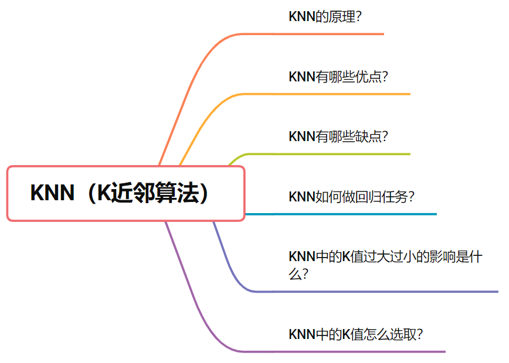

# machine-learning-interview-chinese
全中文的机器学习算法工程师面试基础问题总结

本repo是本人在算法岗求职路上所做的笔记，大概花费了一个多月的时间整理。

我主要面试的岗位大多是:机器学习算法工程师、数据挖掘算法工程师等岗位。

但现在的面试只要是算法岗，一般来说都会默认要求会这些基础知识，所以如果你所面试的岗位不是机器学习算法工程师，但依然是算法岗，我想你依然要掌握以下这些知识。

主要包含机器学习和深度学习的基础部分，以及一些常见基础知识，**本repo可能不会去教会你，所以是入门的同学建议去看下[人工智能的学习路线](https://github.com/chehongshu/Artificial-intelligence-diamond-chinese)，先把这些知识点详细啃会了，再回来把以下内容当作自己复习、整理和总结的材料，这样效果最佳。

机器学习主要由我和我的朋友贝壳er共同整理，深度学习部分由我单独整理。

创建这个repo的目的有以下几点
- 我热爱分享，一直长期开源和写作，自己从中收益，当然也想一直回馈开源。
- 这些是我花费大量时间整理的，我想也会节省大家一些时间
- 还有很多没有概括全面的地方，所以想一直可以去不断的update，如果不开repo可能没有那么大的坚持了
- 大多数资料都是英文的，并且繁多，而这个repo的宗旨是全中文的资料，且简洁
## 初学者
请看
[人工智能的学习路线](https://github.com/chehongshu/Artificial-intelligence-diamond-chinese)

全中文的人工智能教程和资料，只选“精品”，如“钻石”般精致。

## 算法岗求职笔记列表
### 机器学习
- [KNN(K近邻算法) · 六问六答](#1.1)

### 深度学习

- [感知机 · 四问四答](#2.1)
- [DNN(深度神经网络) · 四问五答](#2.2)

## 
K近邻算法

  
 
**点击这里查看文章:**
 - [KNN(K近邻) · 六问六答](https://mp.weixin.qq.com/s?__biz=MzA4ODUxNjUzMQ==&mid=2247498203&idx=1&sn=806834f3f71e9cdb2985cff27c4bd667&chksm=902a4b07a75dc2114f3c726f4e9bf78ff56253aa37d22ed88f5fb54e1f260938ea65bf9ceaaf&token=1524783933&lang=zh_CN#rd) 
 
## 
感知机

 

**点击这里查看文章:**
- [感知机 · 四问四答](https://mp.weixin.qq.com/s?__biz=MzA4ODUxNjUzMQ==&amp;mid=2247496611&amp;idx=1&amp;sn=f7f5cf9a6e7a725965effc868d778802&amp;chksm=902a417fa75dc86997b1fea6deadc7f1f288e5e1addad979f331a3bdf9d53c606739a996355f&token=1689859114&lang=zh_CN#rd)
 
## 
深度神经网络

  
**点击这里查看文章:**
 - [DNN(深度神经网络) · 四问五答](https://mp.weixin.qq.com/s?__biz=MzA4ODUxNjUzMQ==&amp;mid=2247497030&amp;idx=1&amp;sn=aa999be2e266b91182395f621ce10eb1&amp;chksm=902a479aa75dce8cc6a675db60b409c8fa84652b2062cc75474d5802601eb4c9318a644ae839&token=1689859114&lang=zh_CN#rd) 
